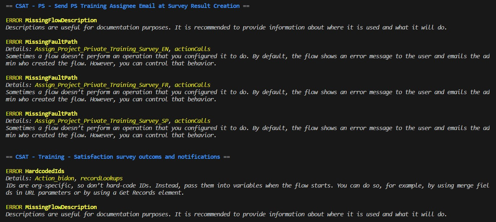

# Lightning Flow Scanner(SFDX Plugin)

[](https://npmjs.org/package/lightning-flow-scanner)
[](https://npmjs.org/package/lightning-flow-scanner)
[](https://npmjs.org/package/lightning-flow-scanner)
[](https://GitHub.com/Force-Config-Control/lightning-flow-scanner-sfdx/stargazers/)
[](https://gitHub.com/Force-Config-Control/lightning-flow-scanner-sfdx/graphs/contributors/)
[](https://github.com/Force-Config-Control/lightning-flow-scanner-sfdx/blob/main/package.json)

__*Identify potential issues and improvements in Salesforce Flows*__



## Table of contents

- [Installation](#installation)
- [Usage](#usage)
  - [Options](#options)
  - [Examples](#examples)
- [Rule overview](#rule-overview)
- [Configuration](#configuration)
  - [Defining the severity per rule](#defining-the-severity-per-rule)
  - [Specifying an exception](#specifying-an-exception)

## Installation

Install with SFDX:

```sh-session
sfdx plugins:install lightning-flow-scanner
```

Install with NPM:

```sh-session
npm install -g lightning-flow-scanner
```

## Usage

```sh-session
sfdx flow:scan [options]
```

### Options

```sh-session
  -c, --config <path>                                               provide a path to the configuration file.

  -f, --failon                                                      provide a threshold level for returning status 1

  -p, --sourcepath <C:\..\flow1.flow, C:\..\flow2.flow>             provide a comma-separated list of flow paths to scan.

  -u, --targetusername <username>                                   retrieve the latest metadata from the target before the scan.

  -d, --directory <C:\..\force-app\main\default\flows>              provide a directory to scan.

  --json                                                            set output format as json.

  --loglevel=(trace|debug|info|warn|error|fatal)                    [default: warn] logging level.
```
### Examples

```sh-sessions
sfdx flow:scan
```

```sh-sessions
sfdx flow:scan --json
```

```sh-sessions
sfdx flow:scan --config path/to/.flow-scanner.json
```

## Rule overview

| Rule       | Id | Description |
|--------------|:-----:|-----------:|
| **DML statements in a loop** |  DMLStatementInLoop | To avoid hitting Apex governor limits, we recommend grouping all of your database changes together at the end of the flow, whether those changes create, update, or delete records. |
| **Duplicate DML operations** |  DuplicateDMLOperationsByNavigation | If the flow commits changes to the database or performs actions between two screens, don't let users navigate back between screen. Otherwise, the flow may perform duplicate database operations. |
| **Hardcoded Ids** | HardcodedIds | IDs are org-specific, so don’t hard-code IDs. Instead, pass them into variables when the flow starts. You can do so, for example, by using merge fields in URL parameters or by using a Get Records element. |
| **Missing flow description** |  MissingFlowDescription | Descriptions are useful for documentation purposes. It is recommended to provide information about where it is used and what it will do. |
| **Missing error handlers** |  MissingFaultPath | Sometimes a flow doesn’t perform an operation that you configured it to do. By default, the flow shows an error message to the user and emails the admin who created the flow. However, you can control that behavior. |
| **Missing null handlers**      |  MissingNullHandler | If a Get Records operation does not find any data it will return null. Use a decision element on the operation result variable to validate that the result is not null. |
| **Unconnected elements** |  UnconnectedElements | Unconnected elements which are not being used by the Flow should be avoided to keep Flows efficient and maintainable. |
| **Unused variables**      |  UnusedVariables | Unused variables which are not being used by the Flow should be avoided to keep Flow more efficient and maintainable. |

**More information on the rules can be found in the [lfs-core module documentation](https://github.com/Force-Config-Control/lightning-flow-scanner-core).**

## Configuration

Create a .flow-scanner.json file in order to configure:
 - The severity of violating any specific rule.
 - Any known exceptions that should be ignored during scanning.

```json
{
    "rules": [
        ...
    ],
    "exceptions": [
        ...
    ]
}
```

_Note: if you prefer YAML format, you can create a `.flow-scanner.yml` file using the same format._

### Defining the severity per rule

When the severity is not provided it will be `error` by default. Other available values for severity are `warning` and `note`. Define the severity per rule as shown in the following example. 

```json
{
  "rules": {
    "MissingFlowDescription": {
      "severity": "warning"
    },
    "UnusedVariables": {
      "severity": "error"
    }
  }
}
```
### Specifying an exception

Specifying exceptions can be done by flow, rule and result(s), as shown in the following example.

```json
{
  "exceptions": {
    "AssignTaskOwner": {
      "UnusedVariables": [
        "somecount"
      ]
    },
    "GetAccounts":{
      "UnusedVariables": [
        "incvar"
      ]
    }
  }
}
```
