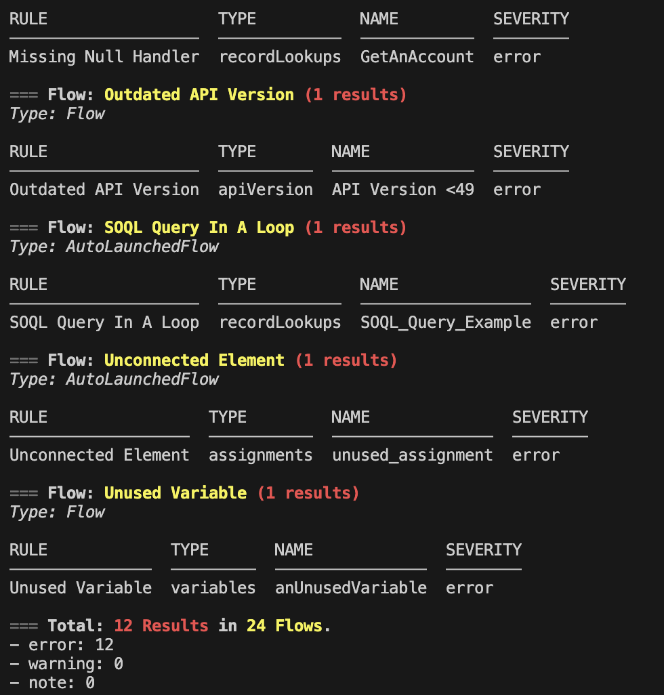

[](https://github.com/Lightning-Flow-Scanner)

__*Analyze Salesforce Flows for optimization and ensure adherence to Industry Best Practices.*__



**Also available as [VS Code Extension](https://github.com/Lightning-Flow-Scanner/lightning-flow-scanner-vsce)*

## Table of contents

- [Installation](#installation)
- [Usage](#usage)
  - [Options](#options)
  - [Examples](#examples)
- [Default Ruleset](#default-ruleset)
- [Configuration](#configuration)
  - [Defining the severity per rule](#defining-the-severity-per-rule)
  - [Specifying an exception](#specifying-an-exception)
  - [Configuring an expression](#configuring-an-expression)
  - [Loading Custom Rules](#loading-custom-rules)
- [Development Setup](#development-setup)

## Installation

Install with SFDX:

```sh-session
sfdx plugins:install lightning-flow-scanner
```

Install with NPM:

```sh-session
npm install -g lightning-flow-scanner
```

## Usage

```sh-session
sfdx flow:scan [options]
```

### Options

```sh-session
  -c, --config <path>                                               provide a path to the configuration file.

  -f, --failon                                                      provide a threshold level for returning status 1

  -p, --sourcepath <C:\..\flow1.flow, C:\..\flow2.flow>             provide a comma-separated list of flow paths to scan.

  -u, --targetusername <username>                                   retrieve the latest metadata from the target before the scan.

  -d, --directory <C:\..\force-app\main\default\flows>              provide a directory to scan.

  --json                                                            set output format as json.

  --loglevel=(trace|debug|info|warn|error|fatal)                    [default: warn] logging level.
```
### Examples

You can test the scanner by simply opening an existing project that contains flows and running the scan without any configurations or parameters. This way all the default rules are autmatically included in the scan. 

```sh-sessions
sfdx flow:scan
```

```sh-sessions
sfdx flow:scan --json
```

```sh-sessions
sfdx flow:scan --config path/to/.flow-scanner.json
```

## Default Ruleset
| Rule       | Description |
|--------------|:-----------|
| **Outdated API Version** | Introducing newer API components may lead to unexpected issues with older versions of Flows, as they might not align with the underlying mechanics. Starting from API version 50.0, the 'Api Version' attribute has been readily available on the Flow Object. To ensure smooth operation and reduce discrepancies between API versions, it is strongly advised to regularly update and maintain them. |
| **Copy API Name** | Maintaining multiple elements with a similar name, like 'Copy_X_Of_Element,' can diminish the overall readability of your Flow. When copying and pasting these elements, it's crucial to remember to update the API name of the newly created copy. |
| **DML Statement In A Loop** |  To prevent exceeding Apex governor limits, it is advisable to consolidate all your database operations, including record creation, updates, or deletions, at the conclusion of the flow. |
| **Duplicate DML Operation** |   When the flow executes database changes or actions between two screens, it's important to prevent users from navigating back between screens. Failure to do so may result in duplicate database operations being performed within the flow. |
| **Hardcoded Id** |  Avoid hard-coding IDs as they are org-specific. Instead, pass them into variables at the start of the flow. You can achieve this by utilizing merge fields in URL parameters or employing a Get Records element. |
| **Flow Naming Convention** |  The readability of a flow is of utmost importance. Establishing a naming convention for the Flow Name significantly enhances findability, searchability, and maintains overall consistency. It is advisable to include at least a domain and a brief description of the actions carried out in the flow, for instance, 'Service_OrderFulfillment'. |
| **Missing Flow Description** |   Descriptions play a vital role in documentation. We highly recommend including details about where they are used and their intended purpose. |
| **Missing Fault Path** |  At times, a flow may fail to execute a configured operation as intended. By default, the flow displays an error message to the user and notifies the admin who created the flow via email. However, you can customize this behavior by incorporating a Fault Path. |
| **Missing Null Handler**      |   When a Get Records operation doesn't find any data, it returns null. To ensure data validation, utilize a decision element on the operation result variable to check for a non-null result. |
| **SOQL Query In A Loop** |  To prevent exceeding Apex governor limits, it is advisable to consolidate all your SOQL queries at the conclusion of the flow. |
| **Unconnected Element** |  Unconnected elements which are not being used by the Flow should be avoided to keep Flows efficient and maintainable. |
| **Unused Variable**      |  To maintain the efficiency and manageability of your Flow, it's advisable to avoid including unconnected variables that are not in use. |

**More information on the rules can be found in the [default ruleset documentation](https://github.com/Lightning-Flow-Scanner/lightning-flow-scanner-core/blob/master/docs/defaultrules.md).**

## Configuration

Create a .flow-scanner.json file in order to configure:
 - The ruleset to be executed.
 - The severity of violating any specific rule.
 - Custom expressions or rule implementations.
 - Any known exceptions that should be ignored during scanning.

```json
{
    "rules": {
        ...
    },
    "exceptions": {
        ...
    }
}
```

_Note: if you prefer YAML format, you can create a `.flow-scanner.yml` file using the same format._

### Defining the severity per rule

When the severity is not provided it will be `error` by default. Other available values for severity are `warning` and `note`. Define the severity per rule as shown in the following example. 

```json
{
  "rules": {
    "FlowDescription": {
      "severity": "warning"
    },
    "UnusedVariable": {
      "severity": "error"
    }
  }
}
```
### Specifying an exception

Specifying exceptions can be done by flow, rule and result(s), as shown in the following example.

```json
{
  "exceptions": {
    "AssignTaskOwner": {
      "UnusedVariable": [
        "somecount"
      ]
    },
    "GetAccounts":{
      "UnusedVariable": [
        "incvar"
      ]
    }
  }
}
```
### Configuring an expression

Some rules have additional attributes to configure, such as the expression, that will overwrite default values. These can be configured in the same way as severity as shown in the following example.

```json
{
  "rules": {
    "APIVersion":
    {
        "severity": "error",
        "expression": "===58"
    },
    "FlowName":
    {
        "severity": "error",
        "expression": "[A-Za-z0-9]"
    }
  }
}
```

### Loading Custom Rules

To load custom rules using the Lightning Flow Scanner Core, you can utilize the `path` attribute within the rules section of your configurations. This attribute allows you to specify the path to your custom rule class, enabling seamless integration of organization-specific rule definitions into the scanner's ruleset. 

```json
{
    "rules": {
        "<RuleName>": {
            "path": "<yourtypescriptfilepath>"
        }
    }
}
```
Custom Rules can either leverage our Flow compiler or be completely customized typescript functions.
For more details and examples on custom rules, refer to our [Custom Rule Creation Guide](https://github.com/Lightning-Flow-Scanner/lightning-flow-scanner-core/tree/master/docs/customruleguide.md)

## Development Setup

### Preparing for Changes

1. **Clone Project**: Clone the Lightning Flow Scanner SFDX plugin project from the repository.
2. **Install Dependencies**: Open the directory and run `npm install` or `yarn install` in the terminal to install the necessary dependencies.
3. **Optional: Make changes**: For example, if you want to upgrade the core module using npm, you can use the  command: `npm update lightning-flow-scanner-core`
4. **Prepack**: Execute `npm run prepack` to build the plugin locally and prepare for packaging.
5. **Link Plugin**: Link the plugin to your Salesforce DX environment using `sfdx plugins link .`.

### Debugging the Plugin

1. **Linking Core Module**: You may need to clone and link the `lightning-flow-scanner-core` locally to your project. This step is necessary if you're making changes to the core module and want those changes reflected in the plugin. You can link the core module by navigating to its directory and running:

```bash
npm link
```

Then, navigate to the sfdx plugin directory and run:

```bash
npm link lightning-flow-scanner-core
```

1. **Run Plugin**: In the terminal of your example flow project (or any other project intended for scanning), run the following command to start the plugin with debugging enabled:

```bash
NODE_OPTIONS=--inspect-brk /path/to/lightning-flow-scanner-sfdx/bin/run flow:scan
```

2. **Attach Debugger**: Open your local Salesforce DX project in Visual Studio Code, set desired breakpoints, and attach the debugger to the remote session.

For more detailed information, you can refer to the [wiki](https://github.com/salesforcecli/cli/wiki) of the Salesforce CLI repository.
